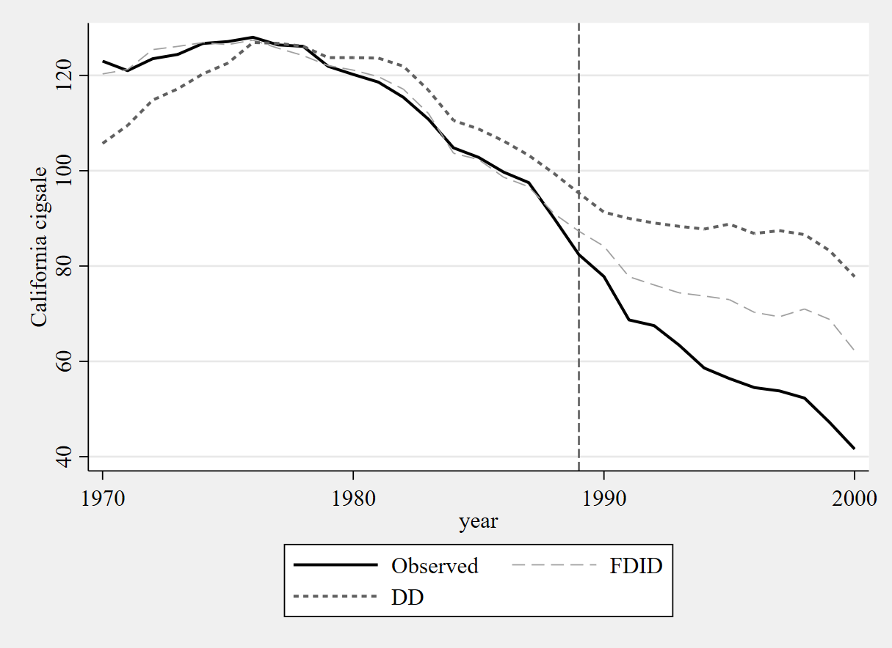

# ```fdid``` for Stata Users

I've already covered the basics of the algorithm in [the Python vignette](https://github.com/jgreathouse9/FDIDTutorial/blob/main/Vignette.md), so I will not repeat myself regarding the basic algorithm and theory. This note simply demonstrates how to use FDID for Stata 16 and up. No special commands are needed to use ```fdid```.

First we install ```fdid``` and its help file into Stata like

```stata
net inst fdid, from("https://raw.githubusercontent.com/jgreathouse9/FDIDTutorial/main") replace
```
We can get the datasets I include like
```stata
net get fdid, all
```
# HCW

The one we're replicating here is [the HCW dataset](https://doi.org/10.1002/jae.1230). We begin by importing the data

```stata
u "hcw.dta", clear
```

Here, we study the impact of Hong Kong's [economic integreation](https://www.henleyglobal.com/residence-investment/hong-kong/cepa-hong-kong-china). We have 44 pretreatment periods and 17 post-treatment periods. Our goal is to estimate the impact for those final 17 periods. To estimate ```fdid```, we simply do
```stata
fdid gdp, tr(treat) unitnames(state) ///
gr1opts(scheme(plottig) ti(Forward DID Analysis) /// using plottig: https://www.stata.com/meeting/switzerland16/slides/bischof-switzerland16.pdf
yti(GDP Growth) note(Treatment is Economic Integration with Mainland China) legend(order(1 "Hong Kong" 2 "FDID Counterfactual") pos(12)))
```
We specify the outcome of interest as ```gdp``` and we specify the treatment as ```treat```. We use the strings of the ```state``` variable to define the names of our units. This syntax produces the table
```stata

Forward Difference-in-Differences          T0 R2:  0.84278     T0 RMSE:  0.01638

-----------------------------------------------------------------------------
         gdp |     ATT     Std. Err.     t      P>|t|    [95% Conf. Interval]
-------------+---------------------------------------------------------------
       treat |   0.02540    0.00462     5.49    0.000     0.01634     0.03447
-----------------------------------------------------------------------------
Treated Unit: hongkong
FDID selects philippines, singapore, thailand, norway, mexico, korea, indonesia, newzealand, malaysia, as the optimal donors.
See Li (2024) for technical details.
```

Pleasingly, these are the exact same results Kathy gets in her MATLAB code. Here is the plot:
<p align="center">
  
</p>

If we wish to see the returned results, we can do
```stata

ereturn list


scalars:
                 e(T1) =  44
                 e(T0) =  45
                 e(T2) =  17
                  e(T) =  61
                 e(r2) =  .8428
               e(DDr2) =  .5046
               e(rmse) =  .0164
                e(N0U) =  9
              e(DDATT) =  .0317
             e(pDDATT) =  77.6203
               e(pATT) =  53.8431
               e(CILB) =  .0163
                e(ATT) =  .0254
               e(CIUB) =  .0345
                 e(se) =  .0046
              e(tstat) =  5.49

macros:
                  e(U) : "philippines, singapore, thailand, norway, mexico, korea, indonesia, newzealand, malaysia,"
         e(properties) : "b V"
             e(depvar) : "gdp"

matrices:
                  e(b) :  1 x 1
                  e(V) :  1 x 1
             e(series) :  61 x 9
            e(results) :  1 x 8

```
The ```e(series)``` is a matrix containing the observed and counterfactual values, event time, individual treatment effects. Naturally, the other statistics pertain to the total number of controls, the number of controls selected, as well as inferential statistics. Note that the fact we have a sparse control group selected (i.e., we didn't select 20 controls) demonstrates the effectiveness of choosing a much smaller subset of controls

The results themselves can also be conveniently accessed like
```stata

mat l e(results)


e(results)[1,8]
                  ATT       PATT         SE          t         LB         UB         R2       RMSE
Statistics  .02540494  53.843074  .00462405  5.4940862  .01634196  .03446791   .8427835     .01638

```

# Proposition 99

Next, I'd like to replicate one of the more classic papers in synthetic control methods, the case of Proposition 99 for California. Prop 99 was an anti-tobacco campaign that sought to reduce the rate of smoking in the population via education, awareness, and taxation. To run this, we do

```stata
qui u smoking, clear

fdid cigsale, tr(treated) unitnames(state) gr1opts(scheme(sj) name(p99, replace))
```
which returns the table
```stata
Forward Difference-in-Differences          T0 R2:     0.988     T0 RMSE:     1.282

-----------------------------------------------------------------------------------------
     cigsale |     ATT       Std. Err.      t       P>|t|    [95% Conf. Interval]
-------------+---------------------------------------------------------------------------
     treated | -13.64671     0.46016      29.66     0.000    -14.54861  -12.74481
-----------------------------------------------------------------------------------------
Treated Unit: California
FDID selects Montana, Colorado, Nevada, Connecticut, as the optimal donors.
See Li (2024) for technical details.
```
and the plot
<p align="center">
  
</p>

We can prove that the same result is given in Stata's native ```xtdidregress```

```stata
xtdidregress (cigsale) (treated), group(id) time(year)
```
which returns
```stata
Number of groups and treatment time

Time variable: year
Control:       treated = 0
Treatment:     treated = 1
-----------------------------------
             |   Control  Treatment
-------------+---------------------
Group        |
          id |        38          1
-------------+---------------------
Time         |
     Minimum |      1970       1989
     Maximum |      1970       1989
-----------------------------------

Difference-in-differences regression                     Number of obs = 1,209
Data type: Longitudinal

                                    (Std. err. adjusted for 39 clusters in id)
------------------------------------------------------------------------------
             |               Robust
     cigsale | Coefficient  std. err.      t    P>|t|     [95% conf. interval]
-------------+----------------------------------------------------------------
ATET         |
     treated |
   (1 vs 0)  |  -27.34911   2.802378    -9.76   0.000    -33.02223   -21.67599
------------------------------------------------------------------------------
Note: ATET estimate adjusted for panel effects and time effects.
```
We get the exact same result as I did in terms of the ATT. I don't compute the standard errors for ```fdid```, but these are by default cluster robust standard errors for ```xtdidregress```. Either way, we can see that the normal DID method has wider confidence intervals than FDID, having a width of 11.346 compared to ```fdid```'s width of 1.8.

As of July 22, 2024, I now plot the DID results by default so people can see how exactly DID compares to FDID. Next, I'll just quote [my notes](https://jgreathouse9.github.io/GSUmetricspolicy/treatmenteffects.html):

> The DID counterfactual underpredicts the true values for California in the pre-intervention period from around 1970 to 1975. Beyond this, it also overestimates the observed California’s values between 1980 and 1988. This is particularly bad because if your predictions diverge significantly from the treated unit’s observed values in the years right before the intervention takes place, why would we think that the post-intervention smoking consumption predictions are valid?

The R-squared of DID here is 0.604, versus FDID's R-squared of 0.988. This naturally has real implications for the analysis' findings. Because the fit for DID in the pre-intervention period is so poor (as a result of non-parallel trends holding across all control units), the DID method badly overestimates the causal effect, returning an ATT of -27.349. FDID fits much better. Its pre-intervention R-squared is higher than DID, meaning that the parallel trends assumption is much more likely to hold for FDID in this instance relative to DID. The effect sizes also differ, with FDID returning an ATT of -13.647. We may also, for additional visualization, looks at the ```e(series)``` to see how the total control group's means differs from the mean of the FDID control group.

To put this another way, the estimates from FDID are basically half of the DID estimate. This is a colossal reduction of effect. Also of interest is that FDID selects 4 control states which, barring Utah, happen to be the exact same states as the original synthetic control method selected, on top of not needing to use retail price of cigarettes, age, income, taxation, and outcome lags to attain what is essentially the same results of other synthetic control methods ([which tend to vary](https://rpubs.com/dwrich27/941298) between -13 and -19, depending on which [flavor](https://doi.org/10.48550/arXiv.2203.11576) of SCM we use). Of course, this assumes that a uniformly weighted average is the ideal way to model the counterfactual, but the point here is that we can get very similar results to the findings of the original model using a relatively simpler estimator which also happens to be qualitatively similar. An added benefit of DID is that inference is more straightforward too.

# Staggered Adoption

[Under Construction]
...

```

Okay, so that's it for the vignette. No doubt people will have questions, suggestions, ideas, or errors to report, concerns, so you may contact me as ususal.

# Contact
- Jared Greathouse: <jgreathouse3@student.gsu.edu> (see [my website](https://jgreathouse9.github.io/))
