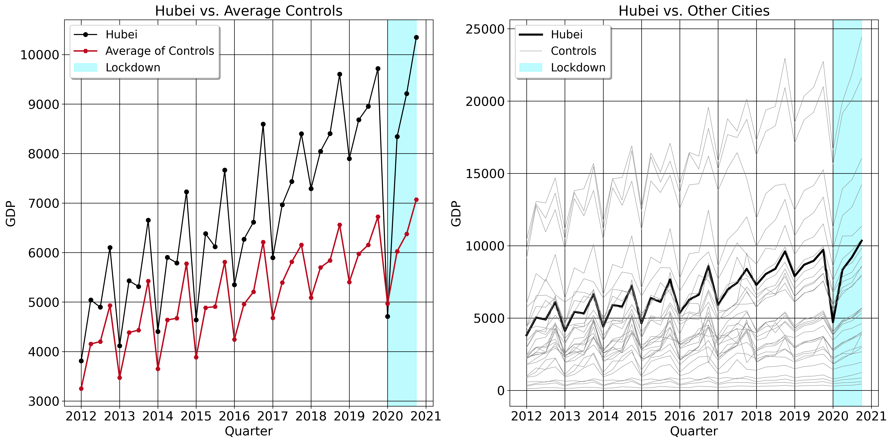
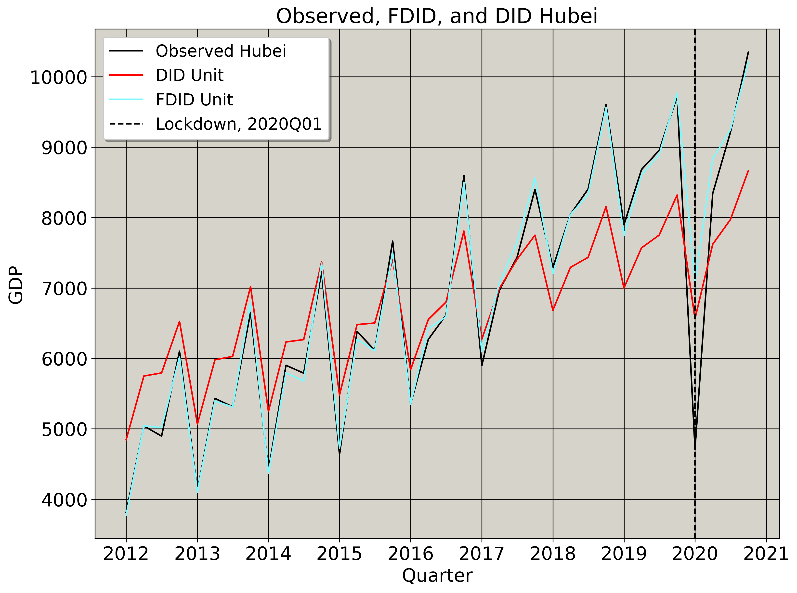

A Tutorial on Forward and Augmented Difference-in-Differences 
==============

***Revisiting Hong Kong's Economic Integration and Hubei's Lockdown***

**Author:** *Jared Greathouse*

# Introduction
This tutorial uses publicly available data to demonstrate the utility of the [Forward](https://doi.org/10.1287/mksc.2022.0212) and [Augmented](https://doi.org/10.1287/mksc.2022.1406) Difference-in-Differences estimators. It is based on the MATLAB code very kindly provided by [Kathleen Li](https://sites.utexas.edu/kathleenli/).

We estimate the counterfactual for two empirical examples: First is GDP Growth for Hong Kong had their economy never economically integrated with Mainland China, [revisiting](https://doi.org/10.1002/jae.1230) the classic panel data approach study. Then we revisit [a more recent study](https://doi.org/10.1002/jae.2871) where we estimate the Quarterly GDP for Hubei had their economy never locked down in 2020 to prevent the spread of COVID-19. This tutorial will consist of two parts: firstly I will go over the anatomy of the class itself, detrailing its helper functions and explaining what each one does. Then I will go over the way to actually estimate the model. However, first we have some preliminaries:
## Prerequisite Libraries
```python
import numpy as np
import pandas as pd
from scipy.stats import norm
import cvxpy as cp
import matplotlib.pyplot as plt
import matplotlib
```
Strictly speaking, you don't need to import ```matplotlib```, I only do so because I am customizing my own graphics.
## Model Primitives
Here, we have units $j \in \mathcal{N}$ across $t \in \left(1, T\right) \cap \mathbb{N}$ time periods. Here, $j=0$ is our treated unit, leaving us with $1 \ldots N$ control units, denoted as set $\mathcal{N}\_{0}$. Partition our time series into sets $\mathcal{T}\coloneqq \mathcal{T}\_{0} \cup \mathcal{T}\_{1}$ with their own cardinalities, where $\mathcal{T}\_{0}\coloneqq  \{1\ldots T_0 \}$ is pre-intervention periods and $\mathcal{T}\_{1}\coloneqq \{T_0+1\ldots T \}$ denotes post-intervention periods. We observe
```math
\begin{equation*}
y_{jt} = 
\begin{cases}
    y^{0}_{jt} & \forall \: j\in \mathcal{N}_0\\
    y^{0}_{0t} & \text{if } j = 0 \text{ and } t \in \mathcal{T}_0 \\
    y^{1}_{0t} & \text{if } j = 0 \text{ and } t \in \mathcal{T}_1
\end{cases}

\end{equation*}
```
where $y_{jt}^1$ and $y_{jt}^0$ respectively are the outcomes we observe under treatment or control.  This means that we observe all of our control units being untreated at all poitns in time, and we observe the outcomes of our treated unit as treated or not. The basic problem of causal inference is that we can't see how Hong Kong or Hubei's GDPs would have evolved in the post-intervention period absent their respective interventions. Thus, we observe $y_{jt} = d_{jt} y_{jt}^1 + (1 - d_{jt}) y_{jt}^0$ where $d \in \[0,1\]$ is a dummy variable indicating treatment or control status. Thus, the counterfactual outcome is something that we must estimate.
## Parallel Trends
Two (**very wrong**) ways we could do this are
- Subtract the average of the pre-intervention GDPs from the post-intervention GDPs, or
- Subtract the average of the treated units from the post-intervention average of the control units.

The first approach assumes that nothing else was impacting the pre and post-GDPs aside from the intervention. The latter presumes that there are no differences (or at least, that they are too small to matter) between the treated units and the control units. DID however makes a slightly more realsitic assumption, called the parallel trends assumption (PTA), $\mathbb{E}\[y_{jt} | d = 1, t \in \mathcal{T}\_{1}\] - \mathbb{E}\[y_{jt} | d = 0, t \in \mathcal{T}\_{1}\] = \delta_0 + \delta_1$. PTA posits the post-intervention trend of our treated unit would be parallel to the average of the control group absent the intervention. Practically speaking, this has an important implication: under classic PTA, all of our control units are similar enough to our treated unit such that the average of the controls is actually parallel to the trend of our treated unit. How true is this assumption though? Because it is an assumption, we cannot perfectly test for it. However, we can test part of it, namely by inspecting the pre-intervention period. So, let's do it for Hubei.
<p align="center">
  
</p>
Let's begin with the graph on the left. The trends actually do appear pretty similar for the first few years (measured at the quarterly level here). Hubei's economy is consistently higher in terms of GDP relative to the average, but they otherwise move in a fairly similar manner. However especially between the years 2016 and 2017, Hubei's trends appear to grow at a faster rate than the average of controls. What this sugests is that there are other important factors affecting the trends of Hubei relative to the simple average of controls. So, parallel trends likely does not hold because from 2017 to the end of 2019, Hubei's trends deviate from the trend of the controls.


On its face though, we should be quite skeptical about the classic PTA. "Why", might we ask, "would _all_ of our control units be a suitable counterfactual for the treated unit?" After all, we know that substantially large values will affect an average. We would not compare the homicide trends, for example, of Newnan Georgia to New Orleans, Louisiana, because Newnan is a completely different area with different demographics and other important factors that might affect the homicide or crime trends. But suppose we add in Miami or Atlanta: these two units, on its face at least, are likely much more comparable to New Orleans than Newnan. Similar in urbanicity and likely other background factors, these units likely serve as better untreated units to compare New Orleans to. It seems obvious that having a way to pick the best set of control units is valuable.

But how? Now consider the graph on the right. Which of these control units are the best ones to comapre to Hubei? Do we, for example, include only cities over a certain GDP threshold? And also, what would it mean empirically for these cities to be similar in GDP? What about geography, do we limit our comparison cities to being within 100 miles of Hubei? Note that the question only becomes amplified in high dimensions. If we had 200 control units, now by what standards would we use? The fact of the matter is that these questions become much too complex for humans to answer, even in situations where we discard other units that were exposed to a treatment or intervention. Thus, the main contribution of FDID is that it uses a machine-learning algorithm called _forward selection_ to select the optimal pool of control units. Now that we have the preliminaries out of the way, we can finally go into the class

# Forward Selection Differences in Differences
## The Class Inputs
Here are the inputs the user may specify.
```python
class FDID:
    def __init__(self, df, unitid, time, outcome, treat,
                 figsize=(12, 6),
                 graph_style="default",
                 grid=True,
                 counterfactual_color="red",
                 treated_color="black",
                 filetype="png",
                 display_graphs=True,
                 ):
        self.df = df
        self.unitid = unitid
        self.time = time
        self.outcome = outcome
        self.treated = treat
        self.figsize = figsize
        self.graph_style = graph_style
        self.grid = grid
        self.counterfactual_color = counterfactual_color
        self.treated_color = treated_color

        self.filetype = filetype
        self.display_graphs = display_graphs
```
The user specifies the dataframe they wish to use, as well as the 4 columns I just mentioned. The user may also customize, should they specify to see graphs, the colors of the trend lines for the observed and FDID predictions.

The FDID class makes a few assumptions about ones data structure. Firstly, it presumes that the user has a long panel dataset of 4 columns, where we have one column for the outcomes, one column for the time, one column of unit names, and one column for the treatment indicator, which in this case is 0 for all periods untreated, and 1 for the treated unit during the treatment period. The code does not do so now, but in future iterations it will test to see that all of these are true.
```python
      Country     GDP  Time  Integration
0   Hong Kong  0.0620     0            0
1   Hong Kong  0.0590     1            0
2   Hong Kong  0.0580     2            0
3   Hong Kong  0.0620     3            0
4   Hong Kong  0.0790     4            0
..        ...     ...   ...          ...
56      China  0.1110    56            0
57      China  0.1167    57            0
58      China  0.1002    58            0
59      China  0.1017    59            0
60      China  0.1238    60            0

[1525 rows x 4 columns]
```
## Vanilla DID
Here is the DID method.
<details>
  <summary>Click to expand/collapse</summary>
    
```python
    def DID(self, y, datax, t1):
        t = len(y)

        x1, x2 = np.mean(datax[:t1], axis=1).reshape(-1,
                                                     1), np.mean(datax[t1:t], axis=1).reshape(-1, 1)

        b_DID = np.mean(y[:t1] - x1, axis=0)  # DID intercept estimator
        y1_DID = b_DID + x1  # DID in-sample-fit
        y2_DID = b_DID + x2  # DID out-of-sample prediction
        y_DID = np.vstack((y1_DID, y2_DID))  # Stack y1_DID and y2_DID vertically

        y1_DID, y2_DID = y_DID[:t1], y_DID[t1:t]

        # DID ATT estimate and percentage

        ATT_DID = np.mean(y[t1:t] - y_DID[t1:t])
        ATT_DID_percentage = 100 * ATT_DID / np.mean(y_DID[t1:t])

        # DID R-square

        R2_DID = 1 - (np.mean((y[:t1] - y_DID[:t1]) ** 2)) / (
            np.mean((y[:t1] - np.mean(y[:t1])) ** 2)
        )

        # Estimated DID residual

        u1_DID = y[:t1] - y_DID[:t1]

        # \hat \Sigma_{1,DID} and \hat \Sigma_{2,DID}
        t2 = t - t1

        Omega_1_hat_DID = (t2 / t1) * np.mean(u1_DID**2)
        Omega_2_hat_DID = np.mean(u1_DID**2)

        # \hat Sigma_{DID}

        std_Omega_hat_DID = np.sqrt(Omega_1_hat_DID + Omega_2_hat_DID)

        # Standardized ATT_DID

        ATT_std_DID = np.sqrt(t2) * ATT_DID / std_Omega_hat_DID

        # P-value for H0: ATT=0

        p_value_DID = 2 * (1 - norm.cdf(np.abs(ATT_std_DID)))

        # P-value for 1-sided test

        p_value_one_sided = 1 - norm.cdf(ATT_std_DID)

        # 95% Confidence Interval for DID ATT estimate

        z_critical = norm.ppf(0.975)  # 1.96 for a two-tailed test
        CI_95_DID_left = ATT_DID - z_critical * std_Omega_hat_DID / np.sqrt(t2)
        CI_95_DID_right = ATT_DID + z_critical * std_Omega_hat_DID / np.sqrt(t2)
        CI_95_DID_width = [
            CI_95_DID_left,
            CI_95_DID_right,
            CI_95_DID_right - CI_95_DID_left,
        ]

        # Metrics of fit subdictionary
        Fit_dict = {
            "T0 RMSE": round(np.std(y[:t1] - y1_DID), 3),
            "R-Squared": round(R2_DID, 3)
        }

        # ATTS subdictionary
        ATTS = {
            "ATT": round(ATT_DID, 3),
            "Percent ATT": round(ATT_DID_percentage, 3),
            "SATT": round(ATT_std_DID, 3),
        }

        # Inference subdictionary
        Inference = {
            "P-Value": round(p_value_DID, 3),
            "95 LB": round(CI_95_DID_left, 3),
            "95 UB": round(CI_95_DID_right, 3),
        }

        # Vectors subdictionary
        Vectors = {
            "Observed Unit": np.round(y, 3),
            "DID Unit": np.round(y_DID, 3),
            "Gap": np.round(y - y_DID, 3)
        }

        # Main dictionary
        DID_dict = {
            "Effects": ATTS,
            "Vectors": Vectors,
            "Fit": Fit_dict,
            "Inference": Inference
        }

        return DID_dict

```
</details>

DID is naturally the main workhorse for the selection algorithm and the ```FDID``` estimator itself. It calculates the DID predictions for a certain input matrix of control units and a vector of treatment unit outcomes.
## Augmented DID
Augmented DID allows for heterogeneous treatment effects. In DID, $\delta_1$ is forced to be equal to 1, whereas in AUGDID this parameter may vary to be any value. For AUGDID, the PTA is that the counterfactual would be parallel to the pure average of controls plus some slope adjusted constant. Notice how both ADID and DID return model fit statistics and ATTs in dictionaries.
<details>
  <summary>Click to expand/collapse</summary>
    
```python
  def AUGDID(self, datax, t, t1, t2, y, y1, y2):
    const = np.ones(t)      # t by 1 vector of ones (for intercept)
    # add an intercept to control unit data matrix, t by N (N=11)
    x = np.column_stack([const, datax])
    x1 = x[:t1, :]          # control units' pretreatment data matrix, t1 by N
    x2 = x[t1:, :]          # control units' pretreatment data matrix, t2 by N

    # ATT estimation by ADID method
    x10 = datax[:t1, :]
    x20 = datax[t1:, :]
    x1_ADID = np.column_stack([np.ones(x10.shape[0]), np.mean(x10, axis=1)])
    x2_ADID = np.column_stack([np.ones(x20.shape[0]), np.mean(x20, axis=1)])
    # Define variables
    b_ADID_cvx = cp.Variable(x1_ADID.shape[1])

    # Define the problem
    objective = cp.Minimize(cp.sum_squares(x1_ADID @ b_ADID_cvx - y1))
    problem = cp.Problem(objective)

    # Solve the problem
    problem.solve()

    # Extract the solution
    b_ADID_optimized = b_ADID_cvx.value

    # Compute in-sample fit
    y1_ADID = x1_ADID @ b_ADID_optimized

    # Compute prediction
    y2_ADID = x2_ADID @ b_ADID_optimized

    # Concatenate in-sample fit and prediction
    y_ADID = np.concatenate([y1_ADID, y2_ADID])

    ATT = np.mean(y2 - y2_ADID)  # ATT by ADID
    ATT_per = 100 * ATT / np.mean(y2_ADID)  # ATT in percentage by ADID

    e1_ADID = (
        y1 - y1_ADID
    )  # t1 by 1 vector of treatment unit's (pre-treatment) residuals
    sigma2_ADID = np.mean(e1_ADID**2)  # \hat sigma^2_e

    eta_ADID = np.mean(x2, axis=0).reshape(-1, 1)
    psi_ADID = x1.T @ x1 / t1

    Omega_1_ADID = (sigma2_ADID * eta_ADID.T) @ np.linalg.inv(psi_ADID) @ eta_ADID
    Omega_2_ADID = sigma2_ADID

    Omega_ADID = (t2 / t1) * Omega_1_ADID + Omega_2_ADID  # Variance

    ATT_std = np.sqrt(t2) * ATT / np.sqrt(Omega_ADID)
    alpha = 0.5
    quantile = norm.ppf(1 - alpha)

    CI_95_DID_left = ATT - quantile * np.sqrt(sigma2_ADID) / np.sqrt(t2)
    CI_95_DID_right = ATT + quantile * np.sqrt(sigma2_ADID) / np.sqrt(t2)

    RMSE = np.sqrt(np.mean((y1 - y1_ADID) ** 2))
    RMSEPost = np.sqrt(np.mean((y2 - y2_ADID) ** 2))

    R2_ADID = 1 - (np.mean((y1 - y1_ADID) ** 2)) / np.mean((y1 - np.mean(y1)) ** 2)

    # P-value for H0: ATT=0

    p_value_aDID = 2 * (1 - norm.cdf(np.abs(ATT_std)))

    CI_95_DID_width = [
        CI_95_DID_left,
        CI_95_DID_right,
        CI_95_DID_right - CI_95_DID_left,
    ]

    # Metrics of fit subdictionary
    Fit_dict = {
        "T0 RMSE": round(np.std(y[:t1] - y1_ADID), 3),
        "R-Squared": round(R2_ADID, 3)
    }

    # ATTS subdictionary
    ATTS = {
        "ATT": round(ATT, 3),
        "Percent ATT": round(ATT_per, 3),
        "SATT": round(ATT_std.item(), 3),
    }

    # Inference subdictionary
    Inference = {
        "P-Value": round(p_value_aDID.item(), 3),
        "95 LB": round(CI_95_DID_left.item(), 3),
        "95 UB": round(CI_95_DID_right.item(), 3)
    }

    # Vectors subdictionary
    Vectors = {
        "Observed Unit": np.round(y, 3),
        "DID Unit": np.round(y_ADID, 3),
        "Gap": np.round(y - y_ADID, 3)
    }

    # Main dictionary
    ADID_dict = {
        "Effects": ATTS,
        "Vectors": Vectors,
        "Fit": Fit_dict,
        "Inference": Inference
    }

    return ADID_dict, y_ADID
```
</details>

## Forward Selection
In Forward Difference-in-Differences (```FDID```), we use the forward selection algorithm to select our control group.
<details>
  <summary>Click to expand/collapse</summary>
    
```python
    def selector(self, no_control, t1, t, y, y1, y2, datax, control_ID, df):
        R2 = np.zeros(no_control) # Creates an empty vector equal in length to the number of controls
        R2final = np.zeros(no_control)
        control_ID_adjusted = np.array(control_ID) - 1 # Adjusts the indexing from MATLAB

        select_c = np.zeros(no_control, dtype=int)

        for j in range(no_control):
            # Over the jth control unit, estimate DID and save its R-squared stat

            ResultDict = self.DID(y.reshape(-1, 1), datax[:t, j].reshape(-1, 1), t1)

            R2[j] = ResultDict["Fit"]["R-Squared"]

        R2final[0] = np.max(R2) # The model with the highest R-Squared
        first_c = np.argmax(R2)
        select_c[0] = control_ID_adjusted[first_c] # The selected unit

        for k in range(2, no_control + 1):
            left = np.setdiff1d(control_ID_adjusted, select_c[: k - 1])
            control_left = datax[:, left]
            R2 = np.zeros(len(left))

            for jj in range(len(left)):
                combined_control = np.concatenate(
                    (
                        datax[:t1, np.concatenate((select_c[: k - 1], [left[jj]]))],
                        datax[t1:t, np.concatenate((select_c[: k - 1], [left[jj]]))]
                    ),
                    axis=0
                )
                ResultDict = self.DID(y.reshape(-1, 1), combined_control, t1)
                R2[jj] = ResultDict["Fit"]["R-Squared"]

            R2final[k - 1] = np.max(R2)
            select = left[np.argmax(R2)]
            select_c[k - 1] = select
        selected_unit_names = [df.columns[i] for i in select_c]

        return select_c, R2final
```
</details>

The method takes as inputs the number of pre-intervention periods, post-periods and total time periods, as well as the treatment vector and the donor matrix. It also prints the names of the optimal control units that are selected. Here is what is going on in more detail.

We take the full pool of control units and iteratively use each control unit to predict, via least-squares, the pre-intervenion outcomes of the treated unit. We then store the model which has the highest $R^2$ statistic. For example, say our treated unit is Washington DC and we have Los Angeles, New York City, Chicago, and Miami as controls. If Los Angeles has the higest $R^2$ when we use it in bivariate regression to predict DC's pre-intervention trends, we store the vector of Los Angeles as the first selected unit. Then, we predict the pre-intervention outcomes for the treated unit using Los Angeles, looping through the other unselected control units. If the model that has NYC and Los Angeles has the highest $R^2$, we then add NYC to the selected pool. Then, we estimate DID with these two control units, and calculate its $R^2$ statistic. Then, if Miami has the next highest, we add Miami and estimate DID again. And so on, until we estimate the sum of $1 \ldots N$ models. After we've done so, we then keep the DID model that has the highest $R^2$ statistic. Intuitively, this is an improvement over the standard average of controls: if the average of all controls does not provide a satisfactory approximation for our treated unit, then using some subset of the controls must perform _at least_ as well. The final pool of control units, termed $\hat{U}$ in the FDID paper, is the final control group that we use.
## Forward DID
Now for the actual estimation.
```python
    def est(self, control, t, t1, t2, y, y1, y2, datax):

        FDID_dict = self.DID(y.reshape(-1, 1), control, t1)

        y_FDID = FDID_dict['Vectors']['DID Unit']

        DID_dict = self.DID(y.reshape(-1, 1), datax, t1)

        AUGDID_dict, y_ADID = self.AUGDID(datax, t, t1, t2, y, y1, y2)
        time_points = np.arange(1, len(y) + 1)

        return FDID_dict, DID_dict, AUGDID_dict, y_FDID
```
Notice how a very simple process is at work here: the ```control``` matrix (or, the matrix of control units that are selected based off index set $\hat{U}$) serves as the new control group, in contrast to ```datax```, the original control group. The method returns the relevant dictionaries of fit and effect size estimates across all designs (```AUGDID```, ```DID``` and ```FDID```). With the helper functions described, we can now go into the main function of the class that the user needs to actually work with, the ```.fit``` method.
## Fitting FDID
<details>
  <summary>Click to expand/collapse</summary>
  
  ```python
def fit(self):
    Ywide = self.df.pivot_table(values=self.outcome, index=self.time, columns=self.unitid, sort=False)
    treated_unit_name = self.df.loc[self.df[self.treated] == 1, self.unitid].values[0]
    y = Ywide[treated_unit_name].values.reshape(-1, 1)
    donor_df = self.df[self.df[self.unitid] != treated_unit_name]
    donor_names = donor_df[self.unitid].unique()
    datax = Ywide[donor_names].values
    no_control = datax.shape[1]
    control_ID = np.arange(1, no_control + 1)

    t = np.shape(y)[0]
    assert t > 5, "You have less than 5 total periods."

    t1 = len(
        self.df[
            (self.df[self.unitid] == treated_unit_name)
            & (self.df[self.treated] == 0)
        ]
    )
    t2 = t - t1
    y1 = np.ravel(y[:t1])
    y2 = np.ravel(y[-t2:])

    control_order, R2_final = self.selector(
        no_control, t1, t, y, y1, y2, datax, control_ID, Ywide
    )
    selected_control_indices = control_order[:R2_final.argmax() + 1]
    selected_control_names = [Ywide.columns[i] for i in selected_control_indices]
    control = datax[:, control_order[: R2_final.argmax() + 1]]

    print(selected_control_names)
    FDID_dict, DID_dict, AUGDID_dict, y_FDID = self.est(
        control, t, t1, t - t1, y, y1, y2, datax
    )

    estimators_results = []
    estimators_results.append({"FDID": FDID_dict})
    estimators_results.append({"DID": DID_dict})
    estimators_results.append({"AUGDID": AUGDID_dict})

    def round_dict_values(input_dict, decimal_places=3):
        rounded_dict = {}
        for key, value in input_dict.items():
            if isinstance(value, dict):
                rounded_dict[key] = round_dict_values(value, decimal_places)
            elif isinstance(value, (int, float, np.float64)):
                rounded_dict[key] = round(value, decimal_places)
            else:
                rounded_dict[key] = value
        return rounded_dict

    estimators_results = [
        round_dict_values(result) for result in estimators_results
    ]

    if self.display_graphs:
        time_axis = self.df[self.df[self.unitid] == treated_unit_name][self.time].values
        intervention_point = self.df.loc[self.df[self.treated] == 1, self.time].min()
        n = np.arange(1, t+1)
        fig = plt.figure(figsize=self.figsize)

        plt.plot(
            n,
            y,
            color=self.treated_color,
            label="Observed " + treated_unit_name,
            linewidth=3
        )
        plt.plot(
            n[: t1],
            y_FDID[: t1],
            color=self.counterfactual_color,
            linewidth=3,
            label="FDID " + treated_unit_name,
        )
        plt.plot(
            n[t1-1:],
            y_FDID[t1-1:],
            color=self.counterfactual_color,
            linestyle="--",
            linewidth=2.5,
        )
        plt.axvline(
            x=intervention_point,
            color="#ed2939",
            linestyle="--", linewidth=2.5,
            label=self.treated + ", " + str(intervention_point),
        )
        upb = max(max(y), max(y_FDID))
        lpb = min(0.5 * min(min(y), min(y_FDID)), 1 * min(min(y), min(y_FDID)))

        plt.ylim(lpb, upb)
        plt.xlabel(self.time)
        plt.ylabel(self.outcome)
        plt.title("FDID Analysis: " + treated_unit_name +
                  " versus Synthetic " + treated_unit_name)
        plt.grid(self.grid)
        plt.legend()
        plt.show()

    return estimators_results

```
</details>

The first step is is to reshape our data to wide, such that the columns of ```Ywide``` are the outcome vectors of each unit in our dataframe. Each row is a time period at some point $t$. Since the column names of ```Ywide``` are the names of our units, we extract the name of the treated unit, or the only unit (in this case) whose treatment variable ever equals 1. We then refer to the column in the wide dataset with the name of the treated unit, and extract its $T \times 1$ vector. We then construct the dataframe of control units, or all the columns that are not named the treated unit, and convert it to a matrix. The shape (or number of columns) of the control matrix ```donor_names``` refers to the $N$ number of control units. We then assign these into an $1 \ldots N$ index. Then, we get the number of time periods, represented by the length/number of rows of the ```y``` vector. We get the number of pre-intervention periods based on the number of periods where the treatment variable is 0 and the unit name column is the name of the treated unit. From there, we simply use the already discussed functions to select the control units and estimate Forward and Augmented DID.

With all this in mind, here is the complete class.
<details>
<summary>Code example</summary>

```python
class FDID:
    def __init__(
        self,
        df,
        unitid,
        time,
        outcome,
        treat,
        figsize=(12, 6),
        graph_style="default",
        grid=True,
        counterfactual_color="red",
        treated_color="black",
        filetype="png",
        display_graphs=True,
    ):
        self.df = df
        self.unitid = unitid
        self.time = time
        self.outcome = outcome
        self.treated = treat
        self.figsize = figsize
        self.graph_style = graph_style
        self.grid = grid
        self.counterfactual_color = counterfactual_color
        self.treated_color = treated_color

        self.filetype = filetype
        self.display_graphs = display_graphs

    def DID(self, y, datax, t1):
        t = len(y)

        x1, x2 = np.mean(datax[:t1], axis=1).reshape(-1, 1), np.mean(
            datax[t1:t], axis=1
        ).reshape(-1, 1)
        x1, x2 = np.mean(datax[:t1], axis=1).reshape(-1,
                                                     1), np.mean(datax[t1:t], axis=1).reshape(-1, 1)
        b_DID = np.mean(y[:t1] - x1, axis=0)  # DID intercept estimator
        y1_DID = b_DID + x1  # DID in-sample-fit
        y2_DID = b_DID + x2  # DID out-of-sample prediction
        y_DID = np.vstack((y1_DID, y2_DID))  # Stack y1_DID and y2_DID vertically

        y1_DID, y2_DID = y_DID[:t1], y_DID[t1:t]

        # DID ATT estimate and percentage

        ATT_DID = np.mean(y[t1:t] - y_DID[t1:t])
        ATT_DID_percentage = 100 * ATT_DID / np.mean(y_DID[t1:t])

        # DID R-square

        R2_DID = 1 - (np.mean((y[:t1] - y_DID[:t1]) ** 2)) / (
            np.mean((y[:t1] - np.mean(y[:t1])) ** 2)
        )

        # Estimated DID residual

        u1_DID = y[:t1] - y_DID[:t1]

        # \hat \Sigma_{1,DID} and \hat \Sigma_{2,DID}

        t2 = t - t1

        Omega_1_hat_DID = (t2 / t1) * np.mean(u1_DID**2)
        Omega_2_hat_DID = np.mean(u1_DID**2)

        # \hat Sigma_{DID}

        std_Omega_hat_DID = np.sqrt(Omega_1_hat_DID + Omega_2_hat_DID)

        # Standardized ATT_DID

        ATT_std_DID = np.sqrt(t2) * ATT_DID / std_Omega_hat_DID

        # P-value for H0: ATT=0

        p_value_DID = 2 * (1 - norm.cdf(np.abs(ATT_std_DID)))

        # P-value for 1-sided test

        p_value_one_sided = 1 - norm.cdf(ATT_std_DID)

        # 95% Confidence Interval for DID ATT estimate

        z_critical = norm.ppf(0.975)  # 1.96 for a two-tailed test
        CI_95_DID_left = ATT_DID - z_critical * std_Omega_hat_DID / np.sqrt(t2)
        CI_95_DID_right = ATT_DID + z_critical * std_Omega_hat_DID / np.sqrt(t2)
        CI_95_DID_width = [
            CI_95_DID_left,
            CI_95_DID_right,
            CI_95_DID_right - CI_95_DID_left,
        ]

        # Metrics of fit subdictionary

        Fit_dict = {
            "T0 RMSE": round(np.std(y[:t1] - y1_DID), 3),
            "R-Squared": round(R2_DID, 3),
        }

        # ATTS subdictionary

        ATTS = {
            "ATT": round(ATT_DID, 3),
            "Percent ATT": round(ATT_DID_percentage, 3),
            "SATT": round(ATT_std_DID, 3),
        }

        # Inference subdictionary

        Inference = {
            "P-Value": round(p_value_DID, 3),
            "95 LB": round(CI_95_DID_left, 3),
            "95 UB": round(CI_95_DID_right, 3),
        }

        # Vectors subdictionary

        Vectors = {
            "Observed Unit": np.round(y, 3),
            "DID Unit": np.round(y_DID, 3),
            "Gap": np.round(y - y_DID, 3),
        }

        # Main dictionary

        DID_dict = {
            "Effects": ATTS,
            "Vectors": Vectors,
            "Fit": Fit_dict,
            "Inference": Inference,
        }

        return DID_dict

    def AUGDID(self, datax, t, t1, t2, y, y1, y2):
        const = np.ones(t)  # t by 1 vector of ones (for intercept)
        # add an intercept to control unit data matrix, t by N (N=11)

        x = np.column_stack([const, datax])
        x1 = x[:t1, :]  # control units' pretreatment data matrix, t1 by N
        x2 = x[t1:, :]  # control units' pretreatment data matrix, t2 by N

        # ATT estimation by ADID method

        x10 = datax[:t1, :]
        x20 = datax[t1:, :]
        x1_ADID = np.column_stack([np.ones(x10.shape[0]), np.mean(x10, axis=1)])
        x2_ADID = np.column_stack([np.ones(x20.shape[0]), np.mean(x20, axis=1)])
        # Define variables

        b_ADID_cvx = cp.Variable(x1_ADID.shape[1])

        # Define the problem

        objective = cp.Minimize(cp.sum_squares(x1_ADID @ b_ADID_cvx - y1))
        problem = cp.Problem(objective)

        # Solve the problem

        problem.solve()

        # Extract the solution

        b_ADID_optimized = b_ADID_cvx.value

        # Compute in-sample fit

        y1_ADID = x1_ADID @ b_ADID_optimized

        # Compute prediction

        y2_ADID = x2_ADID @ b_ADID_optimized

        # Concatenate in-sample fit and prediction

        y_ADID = np.concatenate([y1_ADID, y2_ADID])

        ATT = np.mean(y2 - y2_ADID)  # ATT by ADID
        ATT_per = 100 * ATT / np.mean(y2_ADID)  # ATT in percentage by ADID

        e1_ADID = (
            y1 - y1_ADID
        )  # t1 by 1 vector of treatment unit's (pre-treatment) residuals
        sigma2_ADID = np.mean(e1_ADID**2)  # \hat sigma^2_e

        eta_ADID = np.mean(x2, axis=0).reshape(-1, 1)
        psi_ADID = x1.T @ x1 / t1

        Omega_1_ADID = (sigma2_ADID * eta_ADID.T) @ np.linalg.inv(psi_ADID) @ eta_ADID
        Omega_2_ADID = sigma2_ADID

        Omega_ADID = (t2 / t1) * Omega_1_ADID + Omega_2_ADID  # Variance

        ATT_std = np.sqrt(t2) * ATT / np.sqrt(Omega_ADID)
        alpha = 0.5
        quantile = norm.ppf(1 - alpha)

        CI_95_DID_left = ATT - quantile * np.sqrt(sigma2_ADID) / np.sqrt(t2)
        CI_95_DID_right = ATT + quantile * np.sqrt(sigma2_ADID) / np.sqrt(t2)

        RMSE = np.sqrt(np.mean((y1 - y1_ADID) ** 2))
        RMSEPost = np.sqrt(np.mean((y2 - y2_ADID) ** 2))

        R2_ADID = 1 - (np.mean((y1 - y1_ADID) ** 2)) / np.mean((y1 - np.mean(y1)) ** 2)

        # P-value for H0: ATT=0

        p_value_aDID = 2 * (1 - norm.cdf(np.abs(ATT_std)))

        CI_95_DID_width = [
            CI_95_DID_left,
            CI_95_DID_right,
            CI_95_DID_right - CI_95_DID_left,
        ]

        # Metrics of fit subdictionary

        Fit_dict = {
            "T0 RMSE": round(np.std(y[:t1] - y1_ADID), 3),
            "R-Squared": round(R2_ADID, 3),
        }

        # ATTS subdictionary

        ATTS = {
            "ATT": round(ATT, 3),
            "Percent ATT": round(ATT_per, 3),
            "SATT": round(ATT_std.item(), 3),
        }

        # Inference subdictionary

        Inference = {
            "P-Value": round(p_value_aDID.item(), 3),
            "95 LB": round(CI_95_DID_left.item(), 3),
            "95 UB": round(CI_95_DID_right.item(), 3),
        }

        # Vectors subdictionary

        Vectors = {
            "Observed Unit": np.round(y, 3),
            "DID Unit": np.round(y_ADID, 3),
            "Gap": np.round(y - y_ADID, 3),
        }

        # Main dictionary

        ADID_dict = {
            "Effects": ATTS,
            "Vectors": Vectors,
            "Fit": Fit_dict,
            "Inference": Inference,
        }

        return ADID_dict, y_ADID

    def est(self, control, t, t1, t2, y, y1, y2, datax):

        FDID_dict = self.DID(y.reshape(-1, 1), control, t1)

        y_FDID = FDID_dict["Vectors"]["DID Unit"]

        DID_dict = self.DID(y.reshape(-1, 1), datax, t1)

        AUGDID_dict, y_ADID = self.AUGDID(datax, t, t1, t2, y, y1, y2)
        time_points = np.arange(1, len(y) + 1)

        return FDID_dict, DID_dict, AUGDID_dict, y_FDID

    def selector(self, no_control, t1, t, y, y1, y2, datax, control_ID, df):
        R2 = np.zeros(no_control)
        R2final = np.zeros(no_control)
        control_ID_adjusted = np.array(control_ID) - 1
        select_c = np.zeros(no_control, dtype=int)

        for j in range(no_control):
            ResultDict = self.DID(y.reshape(-1, 1), datax[:t, j].reshape(-1, 1), t1)
            R2[j] = ResultDict["Fit"]["R-Squared"]
        R2final[0] = np.max(R2)
        first_c = np.argmax(R2)
        select_c[0] = control_ID_adjusted[first_c]

        for k in range(2, no_control + 1):
            left = np.setdiff1d(control_ID_adjusted, select_c[: k - 1])
            control_left = datax[:, left]
            R2 = np.zeros(len(left))

            for jj in range(len(left)):
                combined_control = np.concatenate(
                    (
                        datax[:t1, np.concatenate((select_c[: k - 1], [left[jj]]))],
                        datax[t1:t, np.concatenate((select_c[: k - 1], [left[jj]]))],
                    ),
                    axis=0,
                )
                ResultDict = self.DID(y.reshape(-1, 1), combined_control, t1)
                R2[jj] = ResultDict["Fit"]["R-Squared"]
            R2final[k - 1] = np.max(R2)
            select = left[np.argmax(R2)]
            select_c[k - 1] = select
        selected_unit_names = [df.columns[i] for i in select_c]

        return select_c, R2final

    def fit(self):
        Ywide = self.df.pivot_table(
            values=self.outcome, index=self.time, columns=self.unitid, sort=False
        )

        treated_unit_name = self.df.loc[self.df[self.treated] == 1, self.unitid].values[
            0
        ]
        y = Ywide[treated_unit_name].values.reshape(-1, 1)
        donor_df = self.df[self.df[self.unitid] != treated_unit_name]
        donor_names = donor_df[self.unitid].unique()
        datax = Ywide[donor_names].values
        no_control = datax.shape[1]
        control_ID = np.arange(1, no_control + 1)  # 1 row vector from 1 to no_control

        t = np.shape(y)[0]
        assert t > 5, "You have less than 5 total periods."

        t1 = len(
            self.df[
                (self.df[self.unitid] == treated_unit_name)
                & (self.df[self.treated] == 0)
            ]
        )
        t2 = t - t1
        y1 = np.ravel(y[:t1])
        y2 = np.ravel(y[-t2:])

        control_order, R2_final = self.selector(
            no_control, t1, t, y, y1, y2, datax, control_ID, Ywide
        )
        selected_control_indices = control_order[: R2_final.argmax() + 1]
        selected_control_names = [Ywide.columns[i] for i in selected_control_indices]
        control = datax[:, control_order[: R2_final.argmax() + 1]]

        FDID_dict, DID_dict, AUGDID_dict, y_FDID = self.est(
            control, t, t1, t - t1, y, y1, y2, datax
        )

        estimators_results = []
        estimators_results.append({"FDID": FDID_dict})
        # Append the normal DID dictionary to the list

        estimators_results.append({"DID": DID_dict})
        estimators_results.append({"AUGDID": AUGDID_dict})

        def round_dict_values(input_dict, decimal_places=3):
            rounded_dict = {}
            for key, value in input_dict.items():
                if isinstance(value, dict):
                    # Recursively round nested dictionaries

                    rounded_dict[key] = round_dict_values(value, decimal_places)
                elif isinstance(value, (int, float, np.float64)):
                    # Round numeric values

                    rounded_dict[key] = round(value, decimal_places)
                else:
                    rounded_dict[key] = value
            return rounded_dict

        # Round all values in the estimators_results list of dictionaries

        estimators_results = [
            round_dict_values(result) for result in estimators_results
        ]
        if self.display_graphs:

            time_axis = self.df[self.df[self.unitid] == treated_unit_name][
                self.time
            ].values
            intervention_point = self.df.loc[
                self.df[self.treated] == 1, self.time
            ].min()
            n = np.arange(1, t + 1)
            fig = plt.figure(figsize=self.figsize)

            # caption = f"RMSE: {T0 RMSE:.3f}, ATT: {ATT:.3f}, %ATT: {ATT_per:.3f}%"
            # plt.figtext(0.5, 0.01, caption, wrap=True, ha="center", va="top")

            plt.plot(
                n,
                y,
                color=self.treated_color,
                label="Observed " + treated_unit_name,
                linewidth=3,
            )
            plt.plot(
                n[:t1],
                y_FDID[:t1],
                color=self.counterfactual_color,
                linewidth=3,
                label="FDID " + treated_unit_name,
            )
            plt.plot(
                n[t1 - 1 :],
                y_FDID[t1 - 1 :],
                color=self.counterfactual_color,
                linestyle="--",
                linewidth=2.5,
            )
            plt.axvline(
                x=intervention_point,
                color="#ed2939",
                linestyle="--",
                linewidth=2.5,
                label=self.treated + ", " + str(intervention_point),
            )
            upb = max(max(y), max(y_FDID))
            lpb = min(0.5 * min(min(y), min(y_FDID)), 1 * min(min(y), min(y_FDID)))

            # Set y-axis limits

            plt.ylim(lpb, upb)
            plt.xlabel(self.time)
            plt.ylabel(self.outcome)
            plt.title(
                "FDID Analysis: "
                + treated_unit_name
                + " versus Synthetic "
                + treated_unit_name
            )
            plt.grid(self.grid)
            plt.legend()
            # plt.savefig(treated_unit_name + "FDIDfigure." + self.filetype)

            plt.show()
        return estimators_results
```
</details>

# Replicating Hsiao, Ching, Wan 2012
Here is an example of using the full thing. I begin by modifying my graphics to my liking
```python
# Matplotlib theme
Jared_theme = {'axes.grid': True,
               'grid.linestyle': '-',
               'legend.framealpha': 1,
               'legend.facecolor': 'white',
               'legend.shadow': True,
               'legend.fontsize': 16,
               'legend.title_fontsize': 18,
               'xtick.labelsize': 18,
               'ytick.labelsize': 18,
               'axes.labelsize': 18,
               'axes.titlesize': 20,
               'axes.facecolor': 'grey',
               'figure.dpi': 300,
               'grid.color': '#d0d0d0'}

matplotlib.rcParams.update(Jared_theme)
```
Now I import the dataframe (which you may also access in this repo) and do the relvant cleaning to set up the analysis.
<details>
  <summary>Click to expand/collapse</summary>
    
```python
# Define column names

column_names = [
    "Hong Kong",
    "Australia",
    "Austria",
    "Canada",
    "Denmark",
    "Finland",
    "France",
    "Germany",
    "Italy",
    "Japan",
    "Korea",
    "Mexico",
    "Netherlands",
    "New Zealand",
    "Norway",
    "Switzerland",
    "United Kingdom",
    "United States",
    "Singapore",
    "Philippines",
    "Indonesia",
    "Malaysia",
    "Thailand",
    "Taiwan",
    "China",
]

df = pd.read_csv(
    "https://raw.githubusercontent.com/leoyyang/rhcw/master/other/hcw-data.txt",
    header=None,
    delim_whitespace=True,
)
# Or , pd.read_csv(cw-data.txt", header=None, delim_whitespace=True)

# Naming the columns after the countries
df.columns = column_names

df = pd.melt(df, var_name="Country", value_name="GDP", ignore_index=False)

# Add a 'Time' column ranging from 0 to 60

df["Time"] = df.index

df["Integration"] = (df["Country"].str.contains("Hong") & (df["Time"] >= 44)).astype(
    int
)
# The names had some spaces in them, so I lazily
# selected the treated unit based on it having "Hong" in its name.

# Here we define the columns to be used by the class

treat = "Integration"
outcome = "GDP"
unitid = "Country"
time = "Time"
```
</details>

And now for the estimation.
```python
model = FDID(df=df,
             unitid=unitid,
             time=time,
             outcome=outcome,
             treat=treat,
             display_graphs=True, figsize=(12, 6),
             counterfactual_color='#7DF9FF')
estimators_results = model.fit()
```
<p align="center">
  
</p>

Here is our plot. We can also print the results we get in the `estimators_results` list, which returns the method relevant dictionaries:

- FDID ATT: 0.025, Percent ATT: 53.843
- DID ATT: 0.032, Percent ATT: 77.62
- AUGDID ATT: 0.021, Percent ATT: 41.635
  
With these effect sizes, we can see how the method we use affects the $ATT$ we estimate. DID estimates a giant effect size of economic integration, whereas FDID estimate much smaller effects using the optimal control group. In terms of the restrictiveness of their assumptions, DID is the most strict, followed by FDID and AUGDID.
# Replicating Ke and Hsaio 2020
Let's do the next example. This example replicates the findings of  [Ke and Hsiao 2020](https://doi.org/10.1002/jae.2871), which estimated the causal impact of Hubei's lockdown for COVID-19 on the economy, measured as Quarterly GDP. Note that here, I import the ```FDID``` class from my ```mlsynth``` library, which houses ```FDID``` and other counterfactual estimators. ```mlsynth``` is still under development, which is why it is not posted here, however the syntax for FDID remains the same.
```python
import requests
from zipfile import ZipFile
import pandas as pd
from io import BytesIO
from mlsynth import FDID
import matplotlib.pyplot as plt
import matplotlib
# Matplotlib theme
Jared_theme = {'axes.grid': True,
               'grid.linestyle': '-',
               'legend.framealpha': 1,
               'legend.facecolor': 'white',
               'legend.shadow': True,
               'legend.fontsize': 16,
               'legend.title_fontsize': 18,
               'xtick.labelsize': 18,
               'ytick.labelsize': 18,
               'axes.labelsize': 18,
               'axes.titlesize': 20,
               'axes.facecolor': 'white',
               'figure.dpi': 300,
               'grid.color': 'black'}

matplotlib.rcParams.update(Jared_theme)

zip_url = "http://qed.econ.queensu.ca/jae/datasets/ke001/kh-data.zip"

response = requests.get(zip_url)

if response.status_code == 200:
    # Extract the contents of the ZIP file
    with ZipFile(BytesIO(response.content)) as zip_file:
        file_name = zip_file.namelist()[0]

        df = pd.read_csv(zip_file.open(file_name), delimiter="\t", header=None)
        # or, pd.read_csv('kh-data.txt', delimiter="\t", header=None)
else:
    print("The zip file does not exist.")

# Here are our city names.    
cities = [
    "Quarter", "Beijing", "Tianjin", "Hebei", "Shanxi", "Inner Mongolia", 
    "Liaoning", "Jilin", "Heilongjiang", "Shanghai", "Jiangsu", 
    "Zhejiang", "Anhui", "Fujian", "Jiangxi", "Shandong", 
    "Henan", "Hubei", "Hunan", "Guangdong", "Guangxi", 
    "Hainan", "Chongqing", "Sichuan", "Guizhou", "Yunnan", 
    "Tibet", "Shaanxi", "Gansu", "Qinghai", "Ningxia", 
    "Xinjiang"
]

columns_mapping = dict(zip(df.columns, cities))
df.rename(columns=columns_mapping, inplace=True)

df = pd.melt(df, id_vars=["Quarter"], var_name="City", value_name="GDP Growth")

df['Quarter'] = pd.to_datetime(df['Quarter'])

df["Lockdown"] = ((df["Quarter"] > pd.to_datetime("2019-10-01")) & (df["City"].str.contains("Hubei"))).astype(int)

df['Time'] = df.groupby(['City']).cumcount() + 1

# Now for our variables which we feed to the class.

treat = "Lockdown"
outcome = "GDP Growth"
unitid = "City"
time = "Time"

model = FDID(df=df,
             unitid=unitid,
             time=time,
             outcome=outcome,
             treat=treat,
             display_graphs=False, figsize=(12, 8),
             counterfactual_color='#7DF9FF')
final_list = model.fit()

# Plotting observed values only once
observed_values = None

methods_to_plot = ['DID', 'FDID']

# Get our quarter names
quarters = sorted(df['Quarter'].unique())

# Set the figure size before the loop
plt.figure(figsize=(12, 7))

# Plotting observed values and the (F)DID counterfactuals

for method_name in methods_to_plot:
    method_data = [entry[method_name] for entry in final_list if method_name in entry]
    if method_data:
        method_data = method_data[0]  # Take the first occurrence if present

        if observed_values is None:
            observed_values = method_data['Vectors']['Observed Unit'].flatten()
            plt.plot(quarters, observed_values, label='Observed Hubei', color='black')

        unit_values = method_data['Vectors']['DID Unit'].flatten()
        # Set color for FDID method
        color = '#7DF9FF' if method_name == 'FDID' else 'red'

        plt.plot(quarters, unit_values, label=f'{method_name} Unit', color=color)
intervention_time = df[df["Lockdown"] == 1]["Quarter"].iloc[0]
intervention_time_formatted = intervention_time.strftime('%YQ%m')

plt.axvline(x=intervention_time, color='black', linestyle='--', label=f'Lockdown, {intervention_time_formatted}')

plt.xlabel('Quarter')
plt.ylabel('GDP')
plt.legend()
plt.title('Observed, FDID, and DID Hubei')
plt.show()
```
<p align="center">
  
</p>

- FDID ATT: -691.096, Percent ATT: -7.815
- DID ATT: 447.525, Percent ATT: 5.808
- AUGDID ATT: -314.138, Percent ATT: -3.71

Already, we can see how ```FDID``` vastly improves upon the pre-intervention fit of standard DID. Using a control group that is much more similar to Hubei in the pre-2020 period allows the trends to match much more than a naive average and an intercept would. Note however the FDID has a PTA of its own, a much more realistic one. To directly quote the FDID paper,
> If an intercept adjusted treatment unit is outside the range of the control units (e.g., the treatment’s outcome has an upward trend that is steeper than that of all the control units’ outcomes), then this assumption will be violated because no subset of control units can trace the steeper upward trend of the treatment unit. In such a case, the Forward DID method should not be applied, and researchers should consider alternative methods, such as factor modelbased methods, modified synthetic control methods, or the augmented difference-in-differences method.

We can see here, however, that this is a plausible assumption. Hubei does not have the highest or lowest GDP at any point in the time-series, so we would expect FDID's PTA to be plausible.
In addition to weaker assumptions, it is also intersting to note that these results are in line with some of the more flexible estimators from the ```mlsynth``` library. For example, [Robust PCA SCM](https://arxiv.org/abs/2108.12542) has an ATT of -708, and an 8 percent negative impact on the economy. The Factor Model Approach [by Li and Sonnier](https://doi.org/10.1177/00222437221137533) finds a -664 ATT and a percentage decrease of 7.5. AUGDID, as we see above, also predicted a negative effect on Hubei's GDP. I should note that this is _not_ meant to be a formal comparison of these methods, which would actually be quite interesting. However, it _does_ illustrate the fact that the standard parallel trends assumption invoked in the classic DID design may not always hold, and doing so may lead to nonsensical results; here vanilla DID suggests Hubei's lockdown _improved_ the economy, which isn't a very sensible position to take.

It is my hope that in making my code public we can put more of these advanced econometric methods to use for real policy analysis. The benefit is not simply because they're advanced, but because they improve the accuracy of our estimates with a few simple adjustments to standard econometric techniques. This is an ongoing project; any feedback or comments are most welcome!

# Contact
- [Jared Greathouse](jgreathouse3@student.gsu.edu)
- [Kathy Li](kathleen.li@mccombs.utexas.edu)
